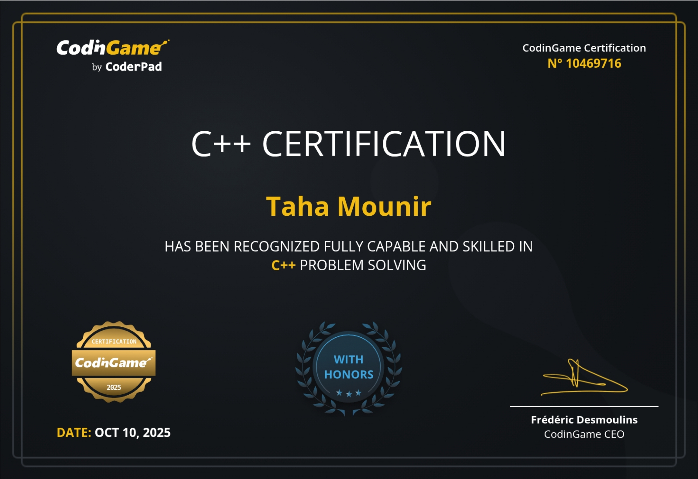

  
  

## root:~$ whoami
>  [1337](https://1337.ma/en/) Student \
>  "Code is like humor. When you have to explain it, it’s bad." – Cory House

### 🎖️ **Certificates**

<table>
   <tr height="320px">
      <!-- C++ certificate -->
      <td>
         <table>
            <tr>
               <td colspan="4">
               </td>
            </tr>
            <tr />
            <tr>
               <td width="220px" height="110px" vertical-align="top" colspan="4">
                <a href="https://www.codingame.com/certification/dtotXt5jXSAU81AFRMpU-A"><strong>C++ certificate</strong></a>, awarded for completing a C++ challenge.
               </td>
            </tr>
            <tr />
            <tr>
               <td align="center">
                  <a href="https://www.codingame.com/certification/dtotXt5jXSAU81AFRMpU-A">
                     <picture>
                        <source media="(prefers-color-scheme: light)" srcset="https://raw.githubusercontent.com/M4rgs/M4rgs/main/docs/icons/icon-demo-light.svg" />
                        <source media="(prefers-color-scheme: dark)" srcset="https://raw.githubusercontent.com/M4rgs/M4rgs/main/docs/icons/icon-demo-dark.svg" />
                        
                     </picture>
                  </a>
               </td>
               <td align="center">
                  <a href="https://www.codingame.com/certification/dtotXt5jXSAU81AFRMpU-A">
                     <picture>
                        <source media="(prefers-color-scheme: light)" srcset="https://raw.githubusercontent.com/M4rgs/M4rgs/main/docs/icons/icon-pdf-light.svg" />
                        <source media="(prefers-color-scheme: dark)" srcset="https://raw.githubusercontent.com/M4rgs/M4rgs/main/docs/icons/icon-pdf-dark.svg" />
                        
                     </picture>
                  </a>
               </td>
               <td align="center">
                  <a href="https://www.codingame.com/certification/dtotXt5jXSAU81AFRMpU-A">
                     <picture>
                        <source media="(prefers-color-scheme: light)" srcset="https://raw.githubusercontent.com/M4rgs/M4rgs/main/docs/icons/icon-github-light.svg" />
                        <source media="(prefers-color-scheme: dark)" srcset="https://raw.githubusercontent.com/M4rgs/M4rgs/main/docs/icons/icon-github-dark.svg" />
                        
                     </picture>
                  </a>
               </td>
            </tr>
         </table>
      </td>
   </tr>
</table>

<pre>

┌──┤ WHOAMI ├─────────▰▰▰  
│  
├─▣ Student at 1337 Khouribga.  
├─▣ From Agadir, Morocco.
├─▣ Up to the challenge.  
├─▣ Passionate about Low-Level.
├─▣ Skilled in C, C++ and Penetration Testing.  
│  
└───────────────────────────────▰▰▰ 

┌──┤ SOCIAL ├─────────▰▰▰
│
├─◈ <a href="https://www.instagram.com/xe.mg">Instagram</a>
├─◈ Discord: xe.mg
│
└───────────────────────────────▰▰▰

┌──┤ 42 PROJECTS ├───────▰▰▰
│
├─◈ <a href="https://github.com/M4rgs/1337_Piscine">1337 Piscine</a>
├─◈ <a href="https://github.com/M4rgs/libft">Libft</a>
├─◈ <a href="https://github.com/M4rgs/Get_Next_Line">Get_Next_Line</a>
├─◈ <a href="https://github.com/M4rgs/MyPrintf">My_Printf</a>
├─◈ <a href="https://github.com/M4rgs/MiniTalk42">MiniTalk</a>
├─◈ <a href="https://github.com/M4rgs/so_long_42">So_long</a>
├─◈ <a href="https://github.com/M4rgs/Push_Swap">Push_Swap</a>
├─◈ <a href="https://github.com/M4rgs/Philosophers">Philosophers</a>
├─◈ <a href="https://github.com/M4rgs/Minishell">Minishell</a>
├─◈ <a href="https://github.com/M4rgs/Cpp_Modules">CPP_Modules</a>
│
└───────────────────────────────▰▰▰

┌──┤ PENTESTING PROJECTS ├───────▰▰▰
│
├─◈ <a href="https://github.com/M4rgs/MargBot-V4/">MargBot Expl0it</a>
├─◈ <a href="https://github.com/M4rgs/ZoneH-Grabber/">Zone-H GraBBer</a>
├─◈ <a href="https://github.com/M4rgs/BlitzMap">BlitzMap</a>
├─◈ <a href="https://github.com/M4rgs/xxe-injection">XML External Entity Injec</a>
├─◈ <a href="https://github.com/M4rgs/CVE-2025-5947_Exploit">WP Service Finder Bookings Exploit</a>
│
└───────────────────────────────▰▰▰

</pre>

  

